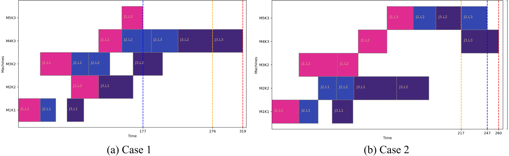

The Implementation of A Modified Multi-agent Proximal Policy Optimization Algorithm For Multi-objective Dynamic Partial-re-rentrant Hybrid Flow Shop Scheduling Problem published in Engineering Applications of Artificial Intelligence:

> New perspective of partial-re-entrance and idle energy consumption (IEC):

Partial-re-entrance:

Layer1: K1->K2->

Layer2: K2->K3->

Layer3: K3.

Dynamic IEC calculation:
In the static scheduling scenario, the shutdown time for machine 5 in case 1 is 177. However, in the reactive dynamic scheduling scenario, the shutdown time for machine 5 should be at
moment 276 when the final operation, namely layer 3 of job 3 at stage 3, starts processing on machine 4. In case 2, after the final operation starts processing, machine 5 still has an operation in progress, thus the shutdown time for machine 5 in case 2 is 247. Compared to case 2, case 1 incurs a higher calculation of the IEC of machine 5. To sum up, reactive dynamic scheduling highlights the challenges of machine standby management.

> The training and testing dataset can be found in train_data/ and test_data/

> The designed key process of PPO and adaptive trust region clipping can be found in agent.py.

> The configured weights can be found in objective_weights.txt.

> Paper citation:

@article{WU2025109688,
	title = {A modified multi-agent proximal policy optimization algorithm for multi-objective dynamic partial-re-entrant hybrid flow shop scheduling problem},
	journal = {Eng. Appl. Artif. Intel.},
	volume = {140},
	pages = {109688},
	year = {2025},
	issn = {0952-1976},
	doi = {https://doi.org/10.1016/j.engappai.2024.109688},
	author = {Jiawei Wu and Yong Liu}
}

